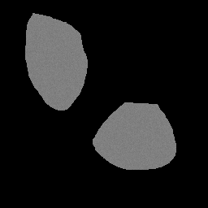
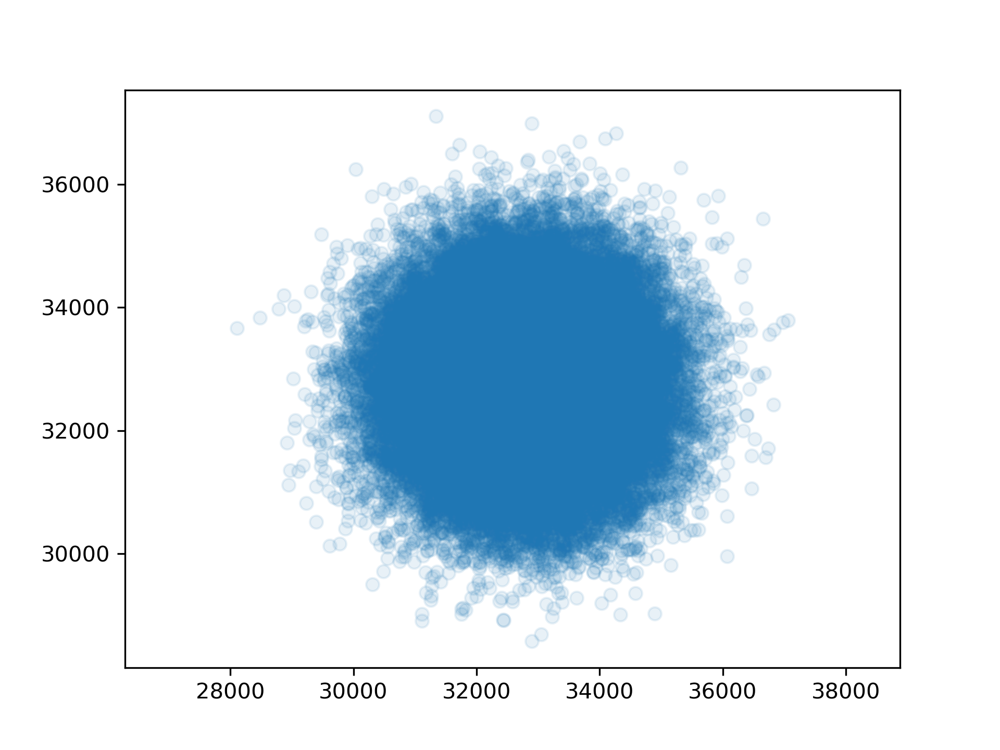
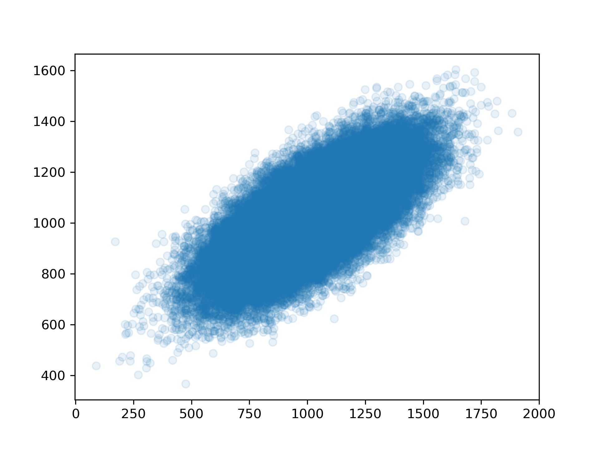
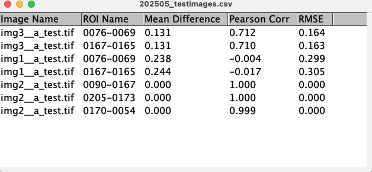

# Calculate the difference between two images

For a small research project, we wanted to quantify the similarity between two images quantitatively.

## Theory

### Relation to co-localization

This is akin to co-localization, but not precisely. For more literature on co-localization, see also:

- https://imagej.net/imaging/colocalization-analysis
-  Jesse S. Aaron, Aaron B. Taylor, and Teng-Leong Chew, ‘Image Co-Localization – Co-Occurrence versus Correlation’, _Journal of Cell Science_ 131, no. 3 (8 February 2018): jcs211847, [https://doi.org/10.1242/jcs.211847](https://doi.org/10.1242/jcs.211847). **(Co-occurence \[overlap\] vs correlation.)**
- Sylvain V. Costes et al., ‘Automatic and Quantitative Measurement of Protein-Protein Colocalization in Live Cells’, _Biophysical Journal_ 86, no. 6 (June 2004): 3993–4003, [https://doi.org/10.1529/biophysj.103.038422](https://doi.org/10.1529/biophysj.103.038422). 

### Image similarity metrics

We quantify the (dis)similarity between two images (or regions thereof) using three metrics.

#### Pearson Correlation

The [Pearson correlation coefficient](https://en.wikipedia.org/wiki/Pearson_correlation_coefficient) is calculated between pixels $x_i$ of image $x$ compared to the pixels $y_i$ of image $y$.

$$
R = \frac{\sum_{i=1}^{n} (x_i - \bar{x})(y_i - \bar{y})}{\sqrt{\sum_{i=1}^{n} (x_i - \bar{x})^2} \sqrt{\sum_{i=1}^{n} (y_i - \bar{y})^2}}
$$

where $n$ is the total number of pixels and $\bar{x}$ and $\bar{y}$ are the means of images $x$ and $y$, respectively, and $R$ the Pearson correlation coefficient.

A higher Pearson correlation coefficient indicates higher similarity between the two images.

#### RMSE

We also calculate the [RMSD](https://en.wikipedia.org/wiki/Root_mean_square_deviation) as follows:

$$
\mathrm{RMSD} = \sqrt{\frac{1}{n} \sum_{i=1}^{n} (x_i - y_i)^2}
$$

where $n$ is the total number of pixels. (Note that this is related to the [Euclidean distance](https://en.wikipedia.org/wiki/Euclidean_distance) between vectors $\vec{x}$ and $\vec{y}$, but an $1/N$ term was added.) A lower RMSD indicates higher similarity between the two images.

#### Mean distance

We furthermore calculate the mean difference between each pixel as follows:

$$
\mathrm{Mean\ Difference} = \frac{1}{n} \sum_{i=1}^{n} |x_i - y_i|
$$

where $n$ is the total number of pixels. A lower mean difference indicates higher similarity between the two images.

## Testing 

To test the script, I added generated images that look something like the following example:



They are generated by `test_data/create_test_images.py`, such that for the following image sets:
- **img1a__test.tif** & **img1b__test.tif**: Both have random Gaussian pixel values.
- **img1a__test.tif** & **img1b__test.tif**: img1a is random; img1b is a scaled version ($y_i = a \cdot x_i$) of img1a (perfect correlation).
- **img1a__test.tif** & **img1b__test.tif**: img1a is random; img1b is a linear combination of img1a and another random image ($y_i = a \cdot x_i + b \cdot y'_i$) (partial correlation).

These images were post-processed in FIJI to create ROIs and annotate those. See the directories: `./test_data/set_a_with_ROIs` and `./test_data/set_b_with_ROIs`.

It is thus expected that the distance metrics reflect, respectively

1. (almost) perfect dissimilarity
2. perfect similarity
3. intermediate similarity

This can also be visualized by scatter plots:

| Set 1 | Set 2 | Set 3 |
| ----- | ----- | ----- |
| Similar | Dissimilar| Intermediate |
|  |  |  | 

This is indeed what is reflected by the metrics (each dot corresponds to an ROI):


## How to use this script

### Step 1: download plugin

Download the file `image-distance-extended-MoreMeasures-ROIs.js` and save it to your computer somewhere you can find it.

### Step 2: sort out and annotate your images

#### File organization


Example organization:
```
test_data/
├── set_a/
│   ├── img1__a_test.tif
│   ├── img2__a_test.tif
│   ├── img1__a_test_roi.zip
│   └── img2__a_test_roi.zip
└── set_b/
    ├── img1__b_test.tif
    └── img2__b_test.tif
```

Organize the picture sets you want to compare into two directories, similar to those in the folders `test_data/set_a_with_ROIs` and `test_data/set_b_with_ROIs`. Sets of images to be compared should be placed such that image A of each of the sets are found in one directory, and image B of each of the sets in the 2nd directory.

Filenames of the images should start with an identifier that identifies
the two images to be compared, followed by two underscores. For example, the image file of which the name starts with `img1__` in the folder `set_a_with_ROIs` will be compared with the file in the folder `set_b_with_ROIs` that also starts with `img1__`, et cetera.


#### Create ROIs

Then, use FIJI to open each image in the `set_a` folder. For each image, determine ROIs that you store in the ROI manager, and save the ROIs into a zip file (select multiple ROIs and choose "more >> save as"). Save that file into the folder of `set_a`, and give it the exact same name as the image file it relates to, except change the file name ending to _roi.zip. E.g. for `img1__a_test.tif` create an ROI file named `img1__a_test_roi.zip`.

### Step 3: run the plugin

Open FIJI again. Now in the menu, choose "plugin >> macros >> run". Navigate to the folder where you stored the plugin (the `.js` file).Select open.

Then set folder 1 to the first folder you created, and folder 2 to the second folder you created. Then press "OK".

The script will now automatically work on calculating the various metrics described above for each ROI. When the script is done, the data will be shown in a table. It might take a while before the script is done.

Your output will look like:



#### Important caveats

The script is not written for robustness. When you don't exactly follow the procedure outlined above (for example, ROI files are not there or have improper names, a second image of a set cannot be found, etc), it might crash, or display unexpected behavior.

Also, it doesn't display clearly that it is running. When it is done, it will show the table. 

Perhaps it is best to first test the script on a limited amount of images, such that you are sure it works before applying it to a large set of images.


