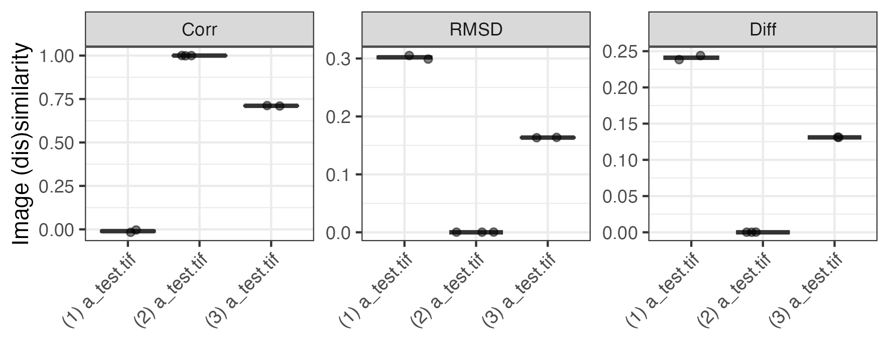

# Calculate the difference between two images

For a small research project, we wanted to quantify the similarity between two images quantitatively.

## Theory

### Relation to co-localization

This is akin to co-localization, but not precisely. For more literature on co-localization, see also:

- https://imagej.net/imaging/colocalization-analysis
-  Jesse S. Aaron, Aaron B. Taylor, and Teng-Leong Chew, ‘Image Co-Localization – Co-Occurrence versus Correlation’, _Journal of Cell Science_ 131, no. 3 (8 February 2018): jcs211847, [https://doi.org/10.1242/jcs.211847](https://doi.org/10.1242/jcs.211847). **(Co-occurence \[overlap\] vs correlation.)**
- Sylvain V. Costes et al., ‘Automatic and Quantitative Measurement of Protein-Protein Colocalization in Live Cells’, _Biophysical Journal_ 86, no. 6 (June 2004): 3993–4003, [https://doi.org/10.1529/biophysj.103.038422](https://doi.org/10.1529/biophysj.103.038422). 

### Image similarity metrics

We quantify the (dis)similarity between two images (or regions thereof) using three metrics.

#### Pearson Correlation

The [Pearson correlation coefficient](https://en.wikipedia.org/wiki/Pearson_correlation_coefficient) is calculated between pixels $x_i$ of image $x$ compared to the pixels $y_i$ of image $y$.

$$
R = \frac{\sum_{i=1}^{n} (x_i - \bar{x})(y_i - \bar{y})}{\sqrt{\sum_{i=1}^{n} (x_i - \bar{x})^2} \sqrt{\sum_{i=1}^{n} (y_i - \bar{y})^2}}
$$

where $n$ is the total number of pixels and $\bar{x}$ and $\bar{y}$ are the means of images $x$ and $y$, respectively, and $R$ the Pearson correlation coefficient.

A higher Pearson correlation coefficient indicates higher similarity between the two images.

#### RMSE

We also calculate the [RMSD](https://en.wikipedia.org/wiki/Root_mean_square_deviation) as follows:

$$
\mathrm{RMSD} = \sqrt{\frac{1}{n} \sum_{i=1}^{n} (x_i - y_i)^2}
$$

where $n$ is the total number of pixels. (Note that this is related to the [Euclidean distance](https://en.wikipedia.org/wiki/Euclidean_distance) between vectors $\vec{x}$ and $\vec{y}$, but an $1/N$ term was added.) A lower RMSD indicates higher similarity between the two images.

#### Mean distance

We furthermore calculate the mean difference between each pixel as follows:

$$
\mathrm{Mean\ Difference} = \frac{1}{n} \sum_{i=1}^{n} |x_i - y_i|
$$

where $n$ is the total number of pixels. A lower mean difference indicates higher similarity between the two images.

## Testing 

